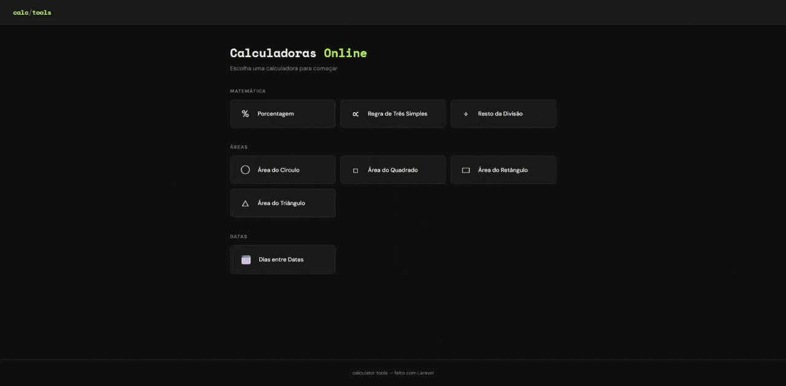

# 🧮 Calculator Tools

> Ferramenta de cálculos online — construída com Laravel 13 e MySQL.



## 📋 Sobre o projeto

O **Calculator Tools** é uma ferramenta de cálculos online que permite realizar operações matemáticas, de áreas geométricas e de datas diretamente pelo navegador — sem necessidade de autenticação, assim como calculadoras online convencionais.

O projeto foi desenvolvido como portfólio para demonstrar conhecimentos em arquitetura MVC com Laravel, registro de métricas no banco de dados e boas práticas de desenvolvimento.

## ✨ Funcionalidades

### Matemática
| Calculadora | Descrição |
|---|---|
| **Porcentagem** | Calcula quanto um valor representa em porcentagem de outro |
| **Regra de Três Simples** | Resolve proporções do tipo C → B / A → X |
| **Resto da Divisão** | Retorna o resto de uma divisão com suporte a decimais |

### Áreas Geométricas
| Calculadora | Fórmula |
|---|---|
| **Círculo** | π × r² |
| **Quadrado** | lado² |
| **Retângulo** | base × altura |
| **Triângulo** | (base × altura) / 2 |

### Datas
| Calculadora | Descrição |
|---|---|
| **Dias entre Datas** | Conta o total de dias entre duas datas |

## 🛠️ Tecnologias utilizadas

- **PHP 8.5** + **Laravel 13**
- **MySQL** — armazena contagem de cálculos realizados
- **Blade** — template engine nativa do Laravel
- **CSS puro** — sem frameworks externos
- **Eloquent ORM** — mapeamento objeto-relacional

## 🏗️ Arquitetura

```
app/
├── Http/
│   └── Controllers/
│       └── CalculadoraController.php   # Lógica de todos os cálculos
└── Models/
    └── Calculo.php                     # Model para registro de métricas

database/
└── migrations/
    └── create_calculos_table.php       # Tabela com enum de tipos

resources/views/
├── layouts/
│   └── app.blade.php                   # Layout base
├── calculadoras/
│   ├── _errors.blade.php               # Partial de erros reutilizável
│   ├── porcentagem.blade.php
│   ├── regra_tres_simples.blade.php
│   ├── resto_da_divisao.blade.php
│   ├── area_circulo.blade.php
│   ├── area_quadrado.blade.php
│   ├── area_retangulo.blade.php
│   ├── area_triangulo.blade.php
│   └── dias_entre_datas.blade.php
└── home.blade.php

routes/
└── web.php                             # 3 rotas
```

**Fluxo de uma requisição:**

```
GET /calculadoras/{tipo} → Controller exibe formulário → Blade renderiza view

POST /calculadoras/{tipo} → Controller processa cálculo → Registra no banco → Retorna resultado
```

## 🗄️ Estrutura do banco de dados

```
calculos
├── id
├── tipo (enum: porcentagem, regra_tres_simples, resto_da_divisao,
│          area_circulo, area_quadrado, area_retangulo,
│          area_triangulo, dias_entre_datas)
└── timestamps
```

A tabela `calculos` registra cada operação realizada — permitindo análise de quais calculadoras são mais usadas e em quais dias.

## 🧠 Decisões técnicas

### Por que sem autenticação?
A ferramenta é pública — qualquer pessoa pode calcular sem criar conta, assim como calculadoras online convencionais. Autenticação adicionaria complexidade desnecessária para esse caso de uso.

### Por que salvar no banco sem histórico por usuário?
O objetivo não é exibir histórico por usuário, mas registrar métricas de uso da ferramenta — quais calculadoras são mais acessadas e em quais dias. Isso permite análise de comportamento sem expor dados de usuários.

### Por que switch em vez de classes separadas?
Para 8 operações simples, a legibilidade do `switch` supera a complexidade de criar uma classe por calculadora. Em um projeto maior, o padrão **Strategy** seria mais adequado — cada operação teria sua própria classe com uma interface comum.

### Por que partial `_errors.blade.php`?
Em vez de repetir o bloco de erros em todas as views, ele foi extraído para um partial reutilizável. Isso segue o princípio DRY (Don't Repeat Yourself) — uma mudança no estilo dos erros afeta todas as calculadoras de uma vez.

## 🚀 Como rodar localmente

### Pré-requisitos

- PHP 8.3+
- Composer
- MySQL

### Instalação

```bash
# 1. Clone o repositório
git clone https://github.com/felipekauan1/calculator-tools-api.git
cd calculator-tools-api

# 2. Instale as dependências
composer install

# 3. Configure o ambiente
cp .env.example .env
php artisan key:generate

# 4. Configure o banco de dados no .env
DB_DATABASE=calculator_tools_api
DB_USERNAME=root
DB_PASSWORD=sua_senha

# 5. Crie o banco e rode as migrations
php artisan migrate
```

### Rodando o projeto

```bash
php artisan serve
```

Acesse `http://localhost:8000/calculadoras` no navegador.

## 🔀 Rotas

| Método | URL | Descrição |
|---|---|---|
| `GET` | `/calculadoras` | Lista todas as calculadoras |
| `GET` | `/calculadoras/{tipo}` | Exibe o formulário de uma calculadora |
| `POST` | `/calculadoras/{tipo}` | Processa o cálculo e retorna o resultado |

## 📸 Screenshots


## 📌 Possíveis melhorias futuras

- Novas calculadoras: IMC, juros compostos, conversão de unidades
- Testes automatizados com PHPUnit
- Padrão Strategy para organizar as operações em classes separadas

## 👨‍💻 Autor

Desenvolvido por **[@felipekauan1](https://github.com/felipekauan1)**

## 📄 Licença

Este projeto está sob a licença MIT.
